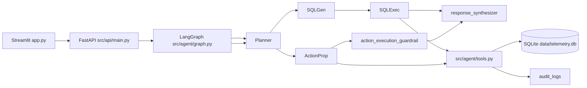

# Fleet Copilot

Agentic IT fleet management copilot built with **LangGraph**. Administrators ask natural-language questions over multi-tenant device telemetry, receive grounded answers with evidence citations, and review proposed hardware actions through a human-in-the-loop approval gate.

## Features

- Grounded Q&A over SQLite telemetry (tenant-scoped SQL)
- Insight-oriented analytics via LLM-generated read-only queries
- Action proposals: upgrades, remediation tickets, replacements, employee notifications
- Guardrails: tenant isolation, read-only SQL, evidence-based action refusal, audit logging
- Human-in-the-loop interrupts before any staged action proceeds
- Deterministic pytest evaluation suite
- Optional LangSmith tracing

## Architecture



### Graph nodes

| Node | Responsibility |
|------|----------------|
| `planner` | Classify request as analytics (`sql`) or operational (`action`) |
| `sql_generation` | Produce tenant-scoped read-only SQL |
| `sql_execution` | Run query with security validation |
| `action_proposal` | Scan latest telemetry anomalies and stage justified actions |
| `action_execution_guardrail` | Pause for administrator approval via LangGraph `interrupt()` |
| `response_synthesizer` | Grounded markdown answer with `[Source: table/pk]` citations |

### Tool catalog

| Tool | Purpose | Evidence required |
|------|---------|-------------------|
| `execute_fleet_query` | Read-only analytics SQL | Valid `company_id` filter |
| `create_upgrade_order` | Disk/memory/battery upgrade | Utilization thresholds or failing battery |
| `open_remediation_ticket` | Compliance remediation | Latest failing compliance check |
| `flag_device_for_replacement` | End-of-life hardware flag | Battery &lt; 50% or disk &gt; 90% |
| `notify_employee` | Employee alert | Device issue or compliance failure |

Staged actions carry an `evidence` payload and remain `pending_approval` until an administrator approves or rejects via the API/UI.

## Prerequisites

- Python 3.12+
- OpenAI API key (for live LLM reasoning)
- Optional: LangSmith API key (for trace observability)
- Optional: Docker + Docker Compose (local demo stack)

The telemetry NDJSON dataset is **not** committed to git. It is downloaded automatically from the assessment Google Drive link during setup.

## Quick start (local)

### 1. Clone and configure

```bash
git clone <repository-url>
cd agentic-copilot
cp .env.example .env
# Edit .env with your OPENAI_API_KEY and optional LANGCHAIN_API_KEY
```

### 2. Run setup (venv, deps, dataset download, ingest)

**Linux / macOS / Git Bash:**

```bash
bash setup.sh
```

**Windows (PowerShell):**

```powershell
python -m venv .venv
.\.venv\Scripts\Activate.ps1
pip install -r requirements.txt
if (-not (Test-Path .env)) { Copy-Item .env.example .env }
python scripts/bootstrap.py
```

`bootstrap.py` will:

1. Download `data/device-telemetry-dataset.ndjson` from Google Drive (`15HqoteWcUOAEy6aNr0JPjfdM-DMQPd2P`)
2. Build `data/telemetry.db` via `python -m src.database.ingest`

Re-run bootstrap after deleting the dataset or database:

```bash
python scripts/bootstrap.py --force-download
```

### 3. Start services

**Terminal 1 — API**

```bash
uvicorn src.api.main:app --reload --host 127.0.0.1 --port 8000
```

**Terminal 2 — Streamlit UI**

```bash
streamlit run app.py
```

Open `http://localhost:8501`. Select a tenant (Acme, Globex, Initech) and chat.

## Docker Compose (local demo)

Docker Compose runs the API and Streamlit UI for local evaluation. It is **not** a production deployment profile.

```bash
cp .env.example .env   # add API keys first
docker compose up --build
```

| Service | URL |
|---------|-----|
| API | http://localhost:8000 |
| UI | http://localhost:8501 |
| Health | http://localhost:8000/health |

On container start, `docker/entrypoint.sh` runs `scripts/bootstrap.py` to ensure the dataset and SQLite DB exist inside the shared `./data` volume.

## Running evaluations

```bash
pytest evals/ -v
```

The suite uses isolated SQLite fixtures and disables live LLM calls for deterministic verification.

| Rubric area | Test module | Coverage |
|-------------|-------------|----------|
| Agent design | `test_copilot.py` | Planner routing, graph node transitions, HITL pause/resume/reject |
| Grounding & correctness | `test_copilot.py` | Unknown metrics, citations, compliance grounding, battery trend SQL |
| Action quality & guardrails | `test_tools.py`, `test_copilot.py` | All five tools, evidence refusal, audit events, tenant isolation |
| Evaluation rigor | `test_ingest.py`, `test_api.py` | Ingest pipeline, FastAPI chat/approve/status flows |
| Engineering | `test_api.py` | API health, 409 conflict handling, thread status |

**Representative cases:**

- Grounding / no-hallucination on unknown metrics
- Tenant isolation enforcement
- Battery-failure and compliance remediation proposals
- Disk/memory upgrade and employee notification tools
- Evidence citation traceability (`[Source: ...]`)
- Unsupported action refusal
- Human-in-the-loop checkpoint, approve, and reject
- SQL read-only enforcement
- Time-series battery decline trend query
- NDJSON ingest schema validation
- REST API pause/approve workflow

## API endpoints

| Method | Path | Description |
|--------|------|-------------|
| `GET` | `/health` | Liveness check |
| `POST` | `/chat` | Start or continue a graph run |
| `POST` | `/approve` | Resume a paused thread (`approved: true/false`) |
| `GET` | `/status/{thread_id}` | Inspect thread state and interrupt payload |

## Grounding strategy

1. **SQL path** — LLM generates read-only, tenant-filtered SQL; results include tracing metadata.
2. **Synthesis** — The response synthesizer must cite `[Source: telemetry_snapshots/<id>]`, `[Source: devices/<id>]`, or `[Source: compliance_checks/<id>]` for every factual claim.
3. **Fallback** — Without an API key, heuristic SQL and a deterministic citation formatter still produce grounded output.
4. **Actions** — Each proposal includes structured `evidence` (snapshot timestamps, utilization %, compliance status, trigger reason).

## Guardrails

| Control | Implementation |
|---------|----------------|
| Tenant isolation | Mandatory `WHERE company_id = '<tenant>'`; foreign tenant literals rejected |
| Read-only analytics | `SELECT`/`WITH` only; forbidden DDL/DML keywords; SQLite read-only URI |
| Action justification | Telemetry thresholds before staging |
| Human approval | LangGraph `interrupt()` blocks graph completion until `/approve` |
| Audit trail | `audit_logs` table records queries, violations, proposals, approvals |

## LangSmith tracing

Set in `.env`:

```env
LANGCHAIN_API_KEY=lsv2_...
LANGCHAIN_TRACING_V2=true
LANGCHAIN_PROJECT=agentic-copilot
```

Traces appear at [smith.langchain.com](https://smith.langchain.com/) under project `agentic-copilot`.

Demo script against a running API:

```bash
python scripts/run_langsmith_demo.py
```

## Project layout

```
agentic-copilot/
├── app.py                  # Streamlit UI
├── docker-compose.yml      # Local API + UI stack
├── Dockerfile
├── evals/
│   ├── conftest.py         # Shared pytest fixtures
│   ├── helpers.py          # Seeded DB + graph test utilities
│   ├── test_copilot.py     # Agent, grounding, guardrails, trends
│   ├── test_tools.py       # Direct tool + audit coverage
│   ├── test_api.py         # FastAPI endpoint flows
│   └── test_ingest.py      # NDJSON ingest pipeline
├── scripts/
│   ├── bootstrap.py        # Download dataset + ingest
│   ├── download_dataset.py
│   └── run_langsmith_demo.py
├── src/
│   ├── agent/              # LangGraph + tools
│   ├── api/                # FastAPI server
│   ├── database/           # NDJSON ingest
│   └── utils/              # Env + audit logger
└── data/                   # Gitignored runtime artifacts
    ├── device-telemetry-dataset.ndjson
    └── telemetry.db
```

## Design decisions and trade-offs

- **LangGraph over a prompt wrapper** — Explicit planner routing, conditional edges, checkpointing, and HITL interrupts provide auditable control flow.
- **Rule-based action scanning** — `action_proposal_node` deterministically maps telemetry anomalies to tools, reducing unsafe LLM tool hallucination. Trade-off: less flexible than fully LLM-planned tool calls.
- **Staged actions, not auto-execution** — Approved actions are logged and summarized; no external ticketing/ERP integration in this take-home scope.
- **SQLite** — Single-file, reproducible analytics store suitable for evaluation; not intended for multi-tenant production scale.
- **Dataset outside git** — Keeps the repository lightweight; `bootstrap.py` fetches the canonical assessment dataset from Google Drive.

## Project limitations and future enhancements

### Current limitations

| Area | Limitation |
|------|------------|
| **Action execution** | After human approval, actions are **not executed** against external systems (Jira, ServiceNow, ERP, email). The copilot stages proposals, pauses for approval, logs `action_proposed` / `human_approval` audit events, and synthesizes a response — but does not open real tickets or place orders. |
| **Trend / insight detection** | Time-series pattern detection is supported via SQL analytics and seeded eval cases, but there is no dedicated insight engine or scheduled trend scanner. Compliance drift and multi-week degradation patterns rely on LLM/heuristic SQL rather than a purpose-built analytics node. |
| **Installed software** | The NDJSON dataset includes `installed_software`, but the SQLite schema and agent tools do not model or query installed applications yet. |
| **LLM action planning** | The action path uses deterministic telemetry scanning instead of LLM-selected tool calls. Safer for guardrails, less adaptive for novel remediation strategies. |
| **Authentication** | `company_id` is client-supplied (demo trust model). No API authentication, RBAC, or per-user audit attribution beyond a static `admin` actor. |
| **Checkpoint persistence** | LangGraph `MemorySaver` is in-process only. Thread state is lost on API restart. |
| **Scale** | Single-node SQLite and synchronous graph execution. Not designed for concurrent multi-tenant production load. |
| **Docker Compose** | Provided for **local demo only**, not a hardened production deployment (no TLS, secrets management, or horizontal scaling). |
| **Evaluation scope** | Evals use seeded fixtures and mocked graph paths for determinism. They do not benchmark live LLM answer quality or end-to-end Streamlit UI flows. |

### Planned future enhancements

1. **Post-approval execution layer** — Add an `action_execution` graph node that records `action_executed` audit events and integrates with ticketing/ERP webhooks after approval.
2. **Dedicated insight service** — Time-window aggregations for battery fade, storage pressure, RAM saturation, and compliance drift with ranked findings and explanations.
3. **Installed software schema** — Extend ingest + SQL generation to answer software inventory and version compliance questions.
4. **LLM tool-calling with guardrails** — Allow the planner to select tools while retaining evidence validators before staging.
5. **Persistent checkpoints** — Swap `MemorySaver` for Postgres/SQLite-backed LangGraph checkpointer.
6. **AuthN / AuthZ** — API keys or SSO, tenant claims bound to session, per-admin audit attribution.
7. **LangSmith eval datasets** — Export pytest scenarios as regression datasets for live-model CI gates.
8. **Production deployment profile** — Hardened Docker/Kubernetes manifests, health probes, and secrets injection separate from the local Compose demo.

## Manual dataset download

If automated download fails (corporate proxy, Drive quota):

1. Open the [assessment dataset](https://drive.google.com/file/d/15HqoteWcUOAEy6aNr0JPjfdM-DMQPd2P/view?usp=sharing)
2. Save as `data/device-telemetry-dataset.ndjson`
3. Run `python -m src.database.ingest`
